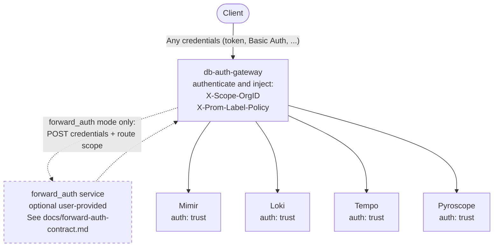
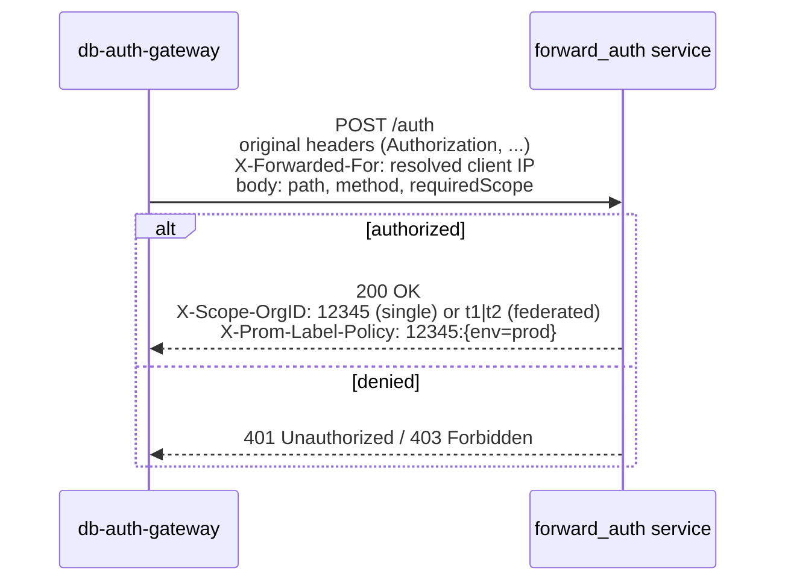
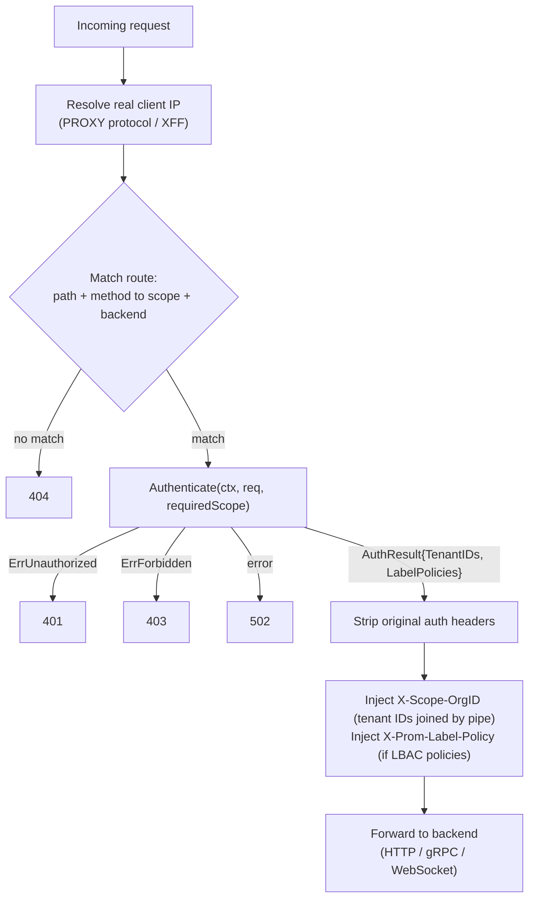

# db-auth-gateway

`db-auth-gateway` is an open source authenticating reverse proxy for [Grafana Mimir](https://github.com/grafana/mimir), [Grafana Loki](https://github.com/grafana/loki), [Grafana Tempo](https://github.com/grafana/tempo), and [Grafana Pyroscope](https://github.com/grafana/pyroscope).

It sits in front of your observability backends, authenticates and authorizes every request, and injects the `X-Scope-OrgID` (and optionally `X-Prom-Label-Policy`) headers that these backends require for multi-tenancy — without requiring Grafana Cloud or any proprietary auth system.

## Why db-auth-gateway

Running OSS Mimir, Loki, Tempo, or Pyroscope in a multi-tenant setup requires a proxy that:

- Validates incoming credentials (tokens, API keys, etc.)
- Resolves the caller to one or more tenant IDs
- Injects `X-Scope-OrgID` so the backend can isolate data per tenant
- Optionally enforces label-based access control (LBAC) via `X-Prom-Label-Policy`

`db-auth-gateway` provides all of this with a **pluggable auth interface** — you bring your own auth logic, the proxy handles the rest.

## Architecture



The proxy enforces auth at the edge; the backends run with `auth.type: trust` and accept `X-Scope-OrgID` as-is. In `forward_auth` mode the gateway delegates credential validation to an optional, user-provided service that returns the tenant IDs and label policies (see [Forward Auth contract](#forward-auth-contract)); in `trust` mode that service is omitted.

## Auth modes

Three built-in modes cover the most common deployment scenarios:

| Mode | Use case |
|------|----------|
| `trust` | In-cluster traffic — reads `X-Scope-OrgID` from the incoming request as-is. No credential validation. |
| `forward_auth` | External traffic with any credential type. Delegates auth to a user-provided HTTP service. Language-agnostic; supports API keys, mTLS, proprietary tokens. |

Any credential type not handled natively (static tokens, mTLS, custom APIs) belongs in a `forward_auth` service — the proxy does not need to know about it.

### Forward Auth contract



## Supported backends and protocols

| Backend | Protocols | Scopes |
|---------|-----------|--------|
| **Mimir** | HTTP/1.1 | `metrics:read`, `metrics:write`, `rules:read`, `rules:write` |
| **Loki** | HTTP/1.1, WebSocket (tail) | `logs:read`, `logs:write`, `logs:delete`, `rules:read`, `rules:write` |
| **Tempo** | HTTP/1.1, gRPC/h2c | `traces:read`, `traces:write` |
| **Pyroscope** | HTTP/1.1, gRPC/h2c | `profiles:read`, `profiles:write` |
| **OTLP unified** | HTTP/1.1, gRPC/h2c | Routes `/otlp/v1/*` to the appropriate backend |

## Request flow



## Configuration

The flags below are the minimum to get a backend serving. Pick the block that
matches `--backend`. For the full flag list, run `db-auth-gateway -help` (also
checked in at [`cmd/db-auth-gateway/generated-help.txt`](cmd/db-auth-gateway/generated-help.txt)).

```
--auth.type=forward_auth          # trust | forward_auth
--forward-auth.url=http://my-auth-service.svc:8080/auth   # required for forward_auth

--backend=mimir                   # mimir | loki | pyroscope | tempo

# Mimir
--gateway.query.endpoint=http://query-frontend.mimir.svc:8080
--gateway.distributor.endpoint=http://distributor.mimir.svc:8080
--gateway.ruler.endpoint=http://ruler.mimir.svc:8080

# Loki
--gateway.query.endpoint=http://query-frontend.loki.svc:3100
--gateway.distributor.endpoint=http://distributor.loki.svc:3100
--loki.tail.endpoint=http://querier.loki.svc:3100

# Pyroscope
--gateway.query.endpoint=http://query-frontend.pyroscope.svc:4040
--gateway.distributor.endpoint=http://distributor.pyroscope.svc:4040

# Tempo
--tempo.query.endpoint=http://query-frontend.tempo.svc:3200
--tempo.distributor.endpoint=http://distributor.tempo.svc:4317
--tempo.distributor.http-endpoint=http://distributor.tempo.svc:4318

--server.http-listen-port=80
--instrumentation.server.port=8001   # /metrics + /debug/pprof; never expose externally
```

By default requests are logged at debug level. Set `--server.log-request-at-info-level-enabled=true` to log them at info level. Run `db-auth-gateway -help` (or see the [flag reference](cmd/db-auth-gateway/generated-help.txt)) for all logging options.

## Header reference

| Header | Separator | Multiple instances? | Example |
|--------|-----------|--------------------|----|
| `X-Scope-OrgID` | pipe `\|` | No — single header value | `X-Scope-OrgID: t1\|t2` |
| `X-Prom-Label-Policy` | comma `,` (within value) | Yes — repeated headers supported | `X-Prom-Label-Policy: t1:%7Benv%3D%22prod%22%7D` |

`X-Prom-Label-Policy` selector values must be percent-encoded. Both forms are equivalent:

```
# Single header, comma-separated:
X-Prom-Label-Policy: t1:{env="prod"},t2:{env="staging"}

# Multiple headers:
X-Prom-Label-Policy: t1:{env="prod"}
X-Prom-Label-Policy: t2:{env="staging"}
```

## Building

```bash
make build          # produces bin/db-auth-gateway
make test           # run all tests
make lint           # run golangci-lint
make reference-help # regenerate the CLI flag reference (run after changing flags)
```

Requires Go 1.24+. Adding, renaming, or changing a flag requires running
`make reference-help` and committing the result; CI fails otherwise.

## Contributing

Contributions are welcome. Please open an issue to discuss significant changes before submitting a pull request.

## License

Licensed under [AGPL-3.0-only](LICENSE).
